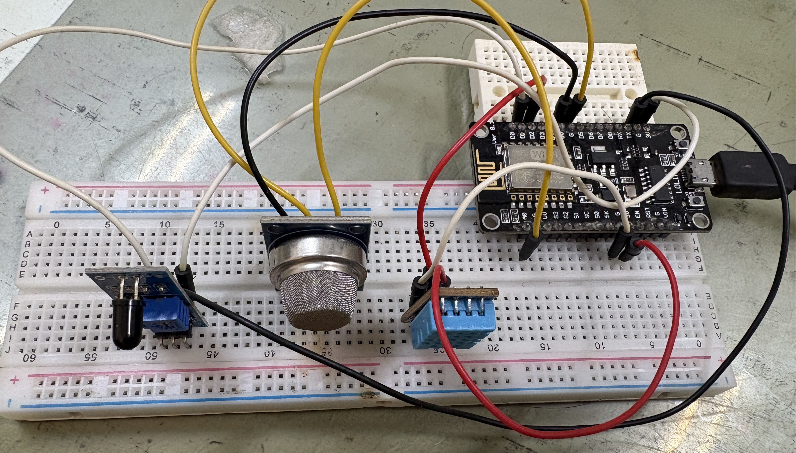
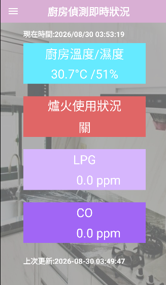

# Detection Gas氣體與火災監測系統

本系統為家庭 / 廚房用氣體與火災監測系統，由三個子專案組成：

| 子專案 | 目錄 | 技術 |
|---|---|---|
| 感測端韌體 | `firmware/` | ESP8266 (Arduino) + MQ氣體感測器 + DHT11 + 火焰感測器 |
| 後端伺服器 | `backend/` | Node.js + Express + MySQL + MQTT |
| 行動應用 | `android/` | Android (Java) |

**資料流程**：ESP8266讀取感測器數據 → 以MQTT發布至Broker（Mosquitto）→ Node.js後端訂閱該主題、寫入MySQL並視門檻值透過 Firebase Cloud Messaging（選用）推播警報 → Android App透過RESTful API讀取即時數據與歷史紀錄。

---

## 一、環境需求與套件安裝 (Windows環境)

### 1. Node.js後端

* 下載並安裝 [Node.js](https://nodejs.org/) (建議18或更新LTS版本，安裝時會自動包含npm)
* 開啟Windows命令提示字元 (cmd) 或PowerShell，至`backend/`目錄安裝套件：

  ```cmd
  cd backend
  npm install
  ```

  `package.json`中定義的相依套件如下（`npm install`會自動安裝）：

  | 套件 | 版本 | 用途 |
  |---|---|---|
  | `express` | ^4.21.2 | HTTP API 伺服器 |
  | `mysql2` | ^3.12.0 | MySQL 連線（Promise 介面） |
  | `mqtt` | ^5.10.3 | 訂閱 MQTT Broker 上的感測器資料 |
  | `firebase-admin` | ^13.0.2 | 推播 FCM 警報通知（選用） |
  | `dotenv` | ^16.4.7 | 讀取 `.env` 環境變數 |

### 2. MySQL資料庫

* 下載並安裝 [MySQL Installer for Windows](https://dev.mysql.com/downloads/installer/) (8.0或以上版本)
* 安裝過程中設定root密碼並啟動MySQL服務 (Windows Service)

### 3. MQTT Broker (Mosquitto)

* 下載並安裝Windows版本 [Mosquitto](https://mosquitto.org/download/)
* 安裝後，只需修改設定檔`mosquitto.conf`，加入以下兩行以允許區域網路連線與匿名存取：

  ```conf
  listener 1883 0.0.0.0
  allow_anonymous true
  ```

### 4. ESP8266韌體 (Arduino IDE)

於Arduino IDE的程式庫管理員安裝：

* **DHT sensor library**（Adafruit）
* **PubSubClient**（Nick O'Leary）
* **ArduinoJson**（建議v6.x）
* **ESP8266WiFi**（安裝ESP8266開發板套件後即內建）

開發板需先透過開發板管理員加入ESP8266支援（開發板選擇NodeMCU 1.0 / ESP-12E Module）。

<p align="center">
  
</p>

### 5. Android App

* 安裝Android Studio，需要Android SDK 32
* 此Gradle 7.3.3專案建議使用**JDK 11**

---

## 二、執行步驟

### 後端

1. **匯入資料庫**：
   開啟命令提示字元，執行以下指令（請替換為你的MySQL root密碼）：

   ```cmd
   mysql -u root -p < backend\schema.sql
   ```

2. **設定環境變數**：
   複製環境變數範本檔：

   ```cmd
   copy backend\.env.example backend\.env
   ```

   編輯`backend\.env`檔案，確認以下欄位：
   * 資料庫連線：`DB_HOST` (通常為 `localhost`)、`DB_USER`、`DB_PASSWORD`、`DB_NAME`
   * MQTT設定：`MQTT_BROKER_URL` (如 `mqtt://localhost:1883`)、`MQTT_SENSOR_TOPIC`

3. **啟動伺服器（建議使用PM2於背景執行，確保穩定運作）：**

   全域安裝PM2：
   ```cmd
   npm install pm2 -g
   ```

   進入後端目錄並啟動服務：
   ```cmd
   cd backend
   pm2 start npm --name "kitchen-backend" -- start
   ```

   儲存PM2執行清單：
   ```cmd
   pm2 save
   ```
   （若僅為開發階段測試，亦可直接執行`cd backend`後使用`npm start`）

4. 開啟瀏覽器造訪`http://localhost:3000/health`確認伺服器正常運作。

    Firebase推播為選用功能：若要啟用，請將Firebase Admin service-account JSON檔案放置於專案外或安全位置，並於`.env`中設定`FIREBASE_SERVICE_ACCOUNT_PATH`。

### ESP8266韌體

1. 使用Arduino IDE開啟`firmware/data_send/data_send.ino`。
2. 修改網路與MQTT設定：

   ```cpp
   const char* ssid        = "YOUR_WIFI_NAME";      // 需為2.4GHz Wi-Fi
   const char* password    = "YOUR_WIFI_PASSWORD";
   const char* mqtt_server = "YOUR_IP";              // 執行Mosquitto的電腦局域網IP(如 192.168.x.x)
   const int   mqtt_port   = 1883;
   const char* mqtt_topic  = "sensor/data";
   ```

3. 開機時請確保環境空氣清新，讓MQ感測器完成基準值（Ro）校準。
4. 選擇開發板**NodeMCU 1.0 (ESP-12E Module)**與對應的COM Port後進行編譯與上傳。

詳細接線圖與資料格式請見 [`firmware/README.md`](firmware/README.md)。

### Android App

* 預設API位址為`http://10.0.2.2:3000`（Android模擬器連回本機電腦的位址），設定於`android/app/build.gradle`中的`API_BASE_URL`。
* 若使用實體手機，請將`API_BASE_URL`改為電腦在區域網路中的實際IP（例如`http://192.168.1.10:3000`）。
* 使用Android Studio開啟`android/`資料夾並建置/執行`app`模組。
* Firebase推播通知為選用功能：若要啟用，請下載對應包名`com.example.detection`的`google-services.json`，放置於`android/app/google-services.json`。

<p align="center">
  
</p>

---

## 三、API一覽

| Method | 路徑 | 說明 | 需要驗證 |
|---|---|---|---|
| GET | `/health` | 健康檢查 | 否 |
| GET | `/api/sensors/latest` | 取得最新一筆感測資料 | 否 |
| GET | `/api/sensors/history?limit=20` | 取得歷史紀錄 | 否 |
| POST | `/api/sensors` | 手動寫入資料（本地測試用） | 否 |
| POST | `/api/auth/login` | 手機號碼驗證登入（臨時Demo用，部署前請替換為正式身份驗證機制） | 否（Demo階段） |

---

## 四、安全注意事項

此專案預設以匿名、無加密的方式連線MQTT，僅適用於受信任的區域網路環境。正式上線前，請務必：

* 為Mosquitto設定帳號密碼與TLS，而非開啟`allow_anonymous true`
* 為後端HTTP API加上HTTPS與正式的使用者身份驗證機制
* 使用密鑰管理工具保管`.env`、`serviceAccountKey.json` 等機敏檔案，不納入版本控制
* 不要將HTTP端點、MQTT Broker或Demo登入介面直接暴露於網際網路
